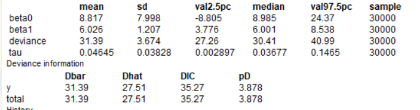

```{r setup, include=FALSE}
knitr::opts_chunk$set(echo = TRUE)
library(tidyverse)
library(R2OpenBUGS)
```

## Exercício de Regressão (Agricultura X Urbanismo)

Os dados  a seguir mostram a escolaridade (X) e o rendimento (Y) de 5 pessoas ocupadas na agricultura e 5 pessoas ocupadas nos setores "urbanos" (indústria ou serviços). Define-se uma variável binária Z que é igual a zero para pessoas ocupadas na agricultura e é igual a um nos demais casos. 

**Você diria que existe diferença entre o rendimento dos trabalhadores dos diferentes setores? (Faça uma análise bayesiana)**


Antes de começarmos, precisamos separar nosso dataset em duas partes, uma apenas com os valores de *z = 0* e outra com os valores para *z=1*.

```{r}
z <- c(rep(0,5),rep(1,5))

x <- c(seq(2,10,2),seq(4,12,2))

y <- c(25,29,45,53,73,47,73,87,109,119)

dad <- data.frame(z=z,x=x,y=y)

#valores para z = 0
dad_0 <- dad |> filter(z == 0)
dad_1 <- dad |> filter(z == 1)
```


A princípio, vamos verificar o modelo linear ajustado pelo mínimos quadrados, utilizando-se da função **lm** do R.

```{r}
# z <- as.factor(z)
# z <- fct_recode(z, Agricultura = '0', Urbano = '1')

dad |> 
  ggplot(aes(x = x, y = y, color = as.factor(z))) +
  geom_point() +
  geom_smooth(method = 'lm', se = FALSE) +
  labs( x = "Escolaridade", y = "Rendimento", color = "Ocupação\n") +
  scale_color_manual(labels = c("Agricultura", "Urbano"), values = c("green", "red")) +
  theme_bw()
```
De início, podemos verificar a partir do gráfico que os tralhadores urbanos apresentam um incremento maior no **Rendimento**, dado uma variação unitária na **Escolaridade**.

Podemos calcular os resultados do modelo linear usando **lm**, para a posterior comparação.

```{r}
summary(lm(dad_0$y~dad_0$x))
```
```{r}
summary(lm(dad_1$y~dad_1$x))
```


## Regressão Linear Bayesiana

Vamos criar um arquivo de texto, que receberá o nosso modelo.Em seguida, faremos duas iterações, uma para **z = 0**, correspondendo ao Trabalhador Agrícola e outra para **z = 1**, referente ao Trabalhador Urbano.

Assumiremos para $\beta_0, \beta_1$ prioris vagas tal que: $\beta_0, \beta_1 \sim \mathcal{N}(0, 10^{-6})$

```{r}
modelo <- function(){
  #definindo a distribuição dos dados
  for (i  in 1:N) {
    y[i] ~ dnorm(mu[i], tau)
    mu[i] <- beta0 + beta1*x[i]
  }
#modelagem da incerteza a priori
#usando uma priori vaga
  
  beta0 ~ dnorm(0.0, 1.0E-6)
  beta1 ~ dnorm(0.0, 1.0E-6)
  tau ~ dgamma(0.001, 0.001)
  sigma2 <- 1/tau #o OPENBUGS trabalha com a precisão, que é o inverso da variancia
}
```

Salvando o modelo em arquivo de texto.
```{r}
mod0 <- file.path(tempdir(), "mod0.txt")

write.model(modelo0, mod0)
```

Executando o modelo para $z = 0$:

```{r}
#Entrada dos dados

#modelo para z = 0
x <- dad_0$x
y <- dad_0$y

N <- length(x)
data <- list('N' = N, 'x' = x, "y" = y)

#atribuindo os valores iniciais para os nós estocásticos
params <- c('beta0','beta1',"tau","sigma")

inits <- list(
  list(beta0 = 1, beta1 = 0.5, tau = 1),
  list(beta0 = 2,beta1=2, tau=10),
  list(beta0 =-1,beta1=2, tau=0.5))

#obtendo as cadeias de markov
out <- bugs(data, inits, params, modelo, codaPkg = TRUE,
            n.chains = 3, n.iter = 14000, n.thin = 1,
            n.burnin = 4000, debug = T)
out.coda <- read.bugs(out)
```
O modelo resultante apresenta o seguinte resumo estatístico:



Executando o modelo para $z = 1$:

```{r}
#Lendo os dados para z = 1
#modelo para z = 0
x <- dad_1$x
y <- dad_1$y

N <- length(x)
data <- list('N' = N, 'x' = x, "y" = y)

#atribuindo os valores iniciais para os nós estocásticos
params <- c('beta0','beta1',"tau","sigma")

inits <- list(
  list(beta0 = 1, beta1 = 0.5, tau = 1),
  list(beta0 = 2,beta1=2, tau=10),
  list(beta0 =-1,beta1=2, tau=0.5))

#obtendo as cadeias de markov
out <- bugs(data, inits, params, modelo, codaPkg = TRUE,
            n.chains = 3, n.iter = 14000, n.thin = 1,
            n.burnin = 4000, debug = T)
out.coda <- read.bugs(out)
```

Analogamente, o modelo para $z=1$ apresenta o seguinte resumo estatístico:

