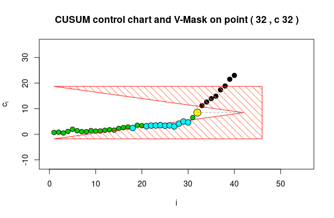

  
```{r setup, include=FALSE}
knitr::opts_chunk$set(echo = TRUE)
```

```{r message = FALSE}
library(tidyverse)
library(knitr)
library(qcc)
library(vMask)
set.seed(1238)
```

## Geração dos dados

Foram gerados um total de 40 observações, provenientes de distribuições Normais independentes, de mesma média e variância amostrada de uma distribuição $\chi^2_{(\nu)}$. As 30 primeiras observações têm média $\mu = 110$ e $\nu = 1$. Já as 10 últimas, $\mu_2 = 112$ e $\nu = 2$, respectivamente.

```{r}
gera_dados <- function(mu, n, m, nu){
  map2_dfc(1:m, rchisq(m, nu), ~rnorm(n, mu, .y))
}
```


```{r message=FALSE}

mu1 <- 110
mu2 <- 112

nu1 <- 1
nu2 <- 2

dados <- rbind(gera_dados(mu1, 30, 5, nu1 ),
               gera_dados(mu2, 10, 5, nu2))
  
kable(head(dados), format = "markdown")
```

## Característica da qualidade

Foram coletadas medições em milímetros do comprimento de mancais com flange de 2 parafusos, realizadas por cinco funcionários de forma independente. Nos primeiros 30 produtos, é assumido que o processo estava sob controle.

Em seguida, houve um problema na forma de injeção. A gerência foi notificada e o processo foi interrompido para reparos na máquina.

## Graficos de controle

### Gráfico de controle X-barra para a amostra toda
```{r}
qcc(dados, type="xbar")
```

### Gráfico de controle X-barra para as primeiras observações

```{r}
qcc(dados[1:30,], type="xbar")
```


### Grafico de controle Xbarra R


```{r}
qcc(dados, type="R")
```


### Grafico de controle Xbarra S


```{r}
qcc(dados, type="S")
```

## 3.) Grafico da soma cumulativa
```{r}
cusum(dados[1:32,])
```


```{r}
dm <- as.matrix(dados)
```


```{r eval = F}
mask <- vMask.method4(data = dm, mu0 = mu1, sleep = "PressEnter")
```



## 4.) CUMSUM tabular

## 5.) Mascara V

## 6.) Verificar a diferença na detecção de anomalias para as técnicas acima

## 7.) Estabelecer os Limites de Especificação

## 8.) Avaliar a capacidade do processo